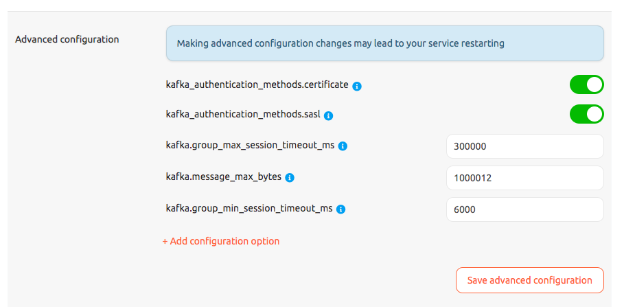
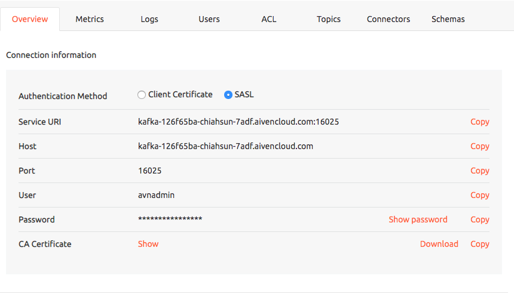

# aiven-kafka-demo

The client is modified from [sarama sasl sram client](https://github.com/Shopify/sarama/tree/master/examples/sasl_scram_client) and refers to the [getting started guide from aiven kafka](https://help.aiven.io/en/articles/489572-getting-started-with-aiven-kafka)

# How to run

## Run without SASL

```
make run-without-sasl
```


## Run with SASL PLAIN

```
make run-sasl-plain
```

## Run with SASL SHA-256

```
make run-sasl-sha256
```

## Run with SASL SHA-512

```
make run-sasl-sha512
```


# Note

You need to enable `kafka_authentication_methods.sasl` under `Overview` > `Advanced configuration`.

The SASL authentication service URI is different from the original client certificate service URI.



